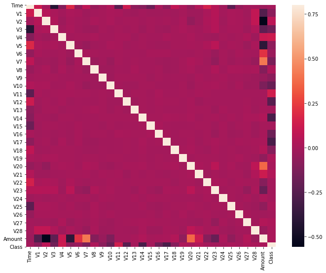

```python
import sys
import numpy
import pandas
import matplotlib
import seaborn
import scipy
import sklearn

print('Python: {}'.format(sys.version))
print('Numpy: {}'.format(sys.version))
print('Pandas: {}'.format(sys.version))
print('Matplotlib: {}'.format(sys.version))
print('Seaborn: {}'.format(sys.version))
print('Scipy: {}'.format(sys.version))
print('Skylearn: {}'.format(sys.version))


```

    Python: 3.7.4 (default, Aug 13 2019, 15:17:50) 
    [Clang 4.0.1 (tags/RELEASE_401/final)]
    Numpy: 3.7.4 (default, Aug 13 2019, 15:17:50) 
    [Clang 4.0.1 (tags/RELEASE_401/final)]
    Pandas: 3.7.4 (default, Aug 13 2019, 15:17:50) 
    [Clang 4.0.1 (tags/RELEASE_401/final)]
    Matplotlib: 3.7.4 (default, Aug 13 2019, 15:17:50) 
    [Clang 4.0.1 (tags/RELEASE_401/final)]
    Seaborn: 3.7.4 (default, Aug 13 2019, 15:17:50) 
    [Clang 4.0.1 (tags/RELEASE_401/final)]
    Scipy: 3.7.4 (default, Aug 13 2019, 15:17:50) 
    [Clang 4.0.1 (tags/RELEASE_401/final)]
    Skylearn: 3.7.4 (default, Aug 13 2019, 15:17:50) 
    [Clang 4.0.1 (tags/RELEASE_401/final)]


```python

```


```python
# import the necessary packages
import numpy as np
import pandas as pd
import matplotlib.pyplot as plt
import seaborn as sns
```


```python
# load the data set from csv 
data = pd.read_csv('creditcard.csv')
```


```python
print(data.columns)
```

    Index(['Time', 'V1', 'V2', 'V3', 'V4', 'V5', 'V6', 'V7', 'V8', 'V9', 'V10',
           'V11', 'V12', 'V13', 'V14', 'V15', 'V16', 'V17', 'V18', 'V19', 'V20',
           'V21', 'V22', 'V23', 'V24', 'V25', 'V26', 'V27', 'V28', 'Amount',
           'Class'],
          dtype='object')


```python
print(data.shape)
```

    (284807, 31)


```python
print(data.describe())
```

                    Time            V1            V2            V3            V4  \
    count  284807.000000  2.848070e+05  2.848070e+05  2.848070e+05  2.848070e+05   
    mean    94813.859575  3.919560e-15  5.688174e-16 -8.769071e-15  2.782312e-15   
    std     47488.145955  1.958696e+00  1.651309e+00  1.516255e+00  1.415869e+00   
    min         0.000000 -5.640751e+01 -7.271573e+01 -4.832559e+01 -5.683171e+00   
    25%     54201.500000 -9.203734e-01 -5.985499e-01 -8.903648e-01 -8.486401e-01   
    50%     84692.000000  1.810880e-02  6.548556e-02  1.798463e-01 -1.984653e-02   
    75%    139320.500000  1.315642e+00  8.037239e-01  1.027196e+00  7.433413e-01   
    max    172792.000000  2.454930e+00  2.205773e+01  9.382558e+00  1.687534e+01   
    
                     V5            V6            V7            V8            V9  \
    count  2.848070e+05  2.848070e+05  2.848070e+05  2.848070e+05  2.848070e+05   
    mean  -1.552563e-15  2.010663e-15 -1.694249e-15 -1.927028e-16 -3.137024e-15   
    std    1.380247e+00  1.332271e+00  1.237094e+00  1.194353e+00  1.098632e+00   
    min   -1.137433e+02 -2.616051e+01 -4.355724e+01 -7.321672e+01 -1.343407e+01   
    25%   -6.915971e-01 -7.682956e-01 -5.540759e-01 -2.086297e-01 -6.430976e-01   
    50%   -5.433583e-02 -2.741871e-01  4.010308e-02  2.235804e-02 -5.142873e-02   
    75%    6.119264e-01  3.985649e-01  5.704361e-01  3.273459e-01  5.971390e-01   
    max    3.480167e+01  7.330163e+01  1.205895e+02  2.000721e+01  1.559499e+01   
    
           ...           V21           V22           V23           V24  \
    count  ...  2.848070e+05  2.848070e+05  2.848070e+05  2.848070e+05   
    mean   ...  1.537294e-16  7.959909e-16  5.367590e-16  4.458112e-15   
    std    ...  7.345240e-01  7.257016e-01  6.244603e-01  6.056471e-01   
    min    ... -3.483038e+01 -1.093314e+01 -4.480774e+01 -2.836627e+00   
    25%    ... -2.283949e-01 -5.423504e-01 -1.618463e-01 -3.545861e-01   
    50%    ... -2.945017e-02  6.781943e-03 -1.119293e-02  4.097606e-02   
    75%    ...  1.863772e-01  5.285536e-01  1.476421e-01  4.395266e-01   
    max    ...  2.720284e+01  1.050309e+01  2.252841e+01  4.584549e+00   
    
                    V25           V26           V27           V28         Amount  \
    count  2.848070e+05  2.848070e+05  2.848070e+05  2.848070e+05  284807.000000   
    mean   1.453003e-15  1.699104e-15 -3.660161e-16 -1.206049e-16      88.349619   
    std    5.212781e-01  4.822270e-01  4.036325e-01  3.300833e-01     250.120109   
    min   -1.029540e+01 -2.604551e+00 -2.256568e+01 -1.543008e+01       0.000000   
    25%   -3.171451e-01 -3.269839e-01 -7.083953e-02 -5.295979e-02       5.600000   
    50%    1.659350e-02 -5.213911e-02  1.342146e-03  1.124383e-02      22.000000   
    75%    3.507156e-01  2.409522e-01  9.104512e-02  7.827995e-02      77.165000   
    max    7.519589e+00  3.517346e+00  3.161220e+01  3.384781e+01   25691.160000   
    
                   Class  
    count  284807.000000  
    mean        0.001727  
    std         0.041527  
    min         0.000000  
    25%         0.000000  
    50%         0.000000  
    75%         0.000000  
    max         1.000000  
    
    [8 rows x 31 columns]


```python
print(data.info)
```

    <bound method DataFrame.info of             Time         V1         V2        V3        V4        V5  \
    0            0.0  -1.359807  -0.072781  2.536347  1.378155 -0.338321   
    1            0.0   1.191857   0.266151  0.166480  0.448154  0.060018   
    2            1.0  -1.358354  -1.340163  1.773209  0.379780 -0.503198   
    3            1.0  -0.966272  -0.185226  1.792993 -0.863291 -0.010309   
    4            2.0  -1.158233   0.877737  1.548718  0.403034 -0.407193   
    ...          ...        ...        ...       ...       ...       ...   
    284802  172786.0 -11.881118  10.071785 -9.834783 -2.066656 -5.364473   
    284803  172787.0  -0.732789  -0.055080  2.035030 -0.738589  0.868229   
    284804  172788.0   1.919565  -0.301254 -3.249640 -0.557828  2.630515   
    284805  172788.0  -0.240440   0.530483  0.702510  0.689799 -0.377961   
    284806  172792.0  -0.533413  -0.189733  0.703337 -0.506271 -0.012546   
    
                  V6        V7        V8        V9  ...       V21       V22  \
    0       0.462388  0.239599  0.098698  0.363787  ... -0.018307  0.277838   
    1      -0.082361 -0.078803  0.085102 -0.255425  ... -0.225775 -0.638672   
    2       1.800499  0.791461  0.247676 -1.514654  ...  0.247998  0.771679   
    3       1.247203  0.237609  0.377436 -1.387024  ... -0.108300  0.005274   
    4       0.095921  0.592941 -0.270533  0.817739  ... -0.009431  0.798278   
    ...          ...       ...       ...       ...  ...       ...       ...   
    284802 -2.606837 -4.918215  7.305334  1.914428  ...  0.213454  0.111864   
    284803  1.058415  0.024330  0.294869  0.584800  ...  0.214205  0.924384   
    284804  3.031260 -0.296827  0.708417  0.432454  ...  0.232045  0.578229   
    284805  0.623708 -0.686180  0.679145  0.392087  ...  0.265245  0.800049   
    284806 -0.649617  1.577006 -0.414650  0.486180  ...  0.261057  0.643078   
    
                 V23       V24       V25       V26       V27       V28  Amount  \
    0      -0.110474  0.066928  0.128539 -0.189115  0.133558 -0.021053  149.62   
    1       0.101288 -0.339846  0.167170  0.125895 -0.008983  0.014724    2.69   
    2       0.909412 -0.689281 -0.327642 -0.139097 -0.055353 -0.059752  378.66   
    3      -0.190321 -1.175575  0.647376 -0.221929  0.062723  0.061458  123.50   
    4      -0.137458  0.141267 -0.206010  0.502292  0.219422  0.215153   69.99   
    ...          ...       ...       ...       ...       ...       ...     ...   
    284802  1.014480 -0.509348  1.436807  0.250034  0.943651  0.823731    0.77   
    284803  0.012463 -1.016226 -0.606624 -0.395255  0.068472 -0.053527   24.79   
    284804 -0.037501  0.640134  0.265745 -0.087371  0.004455 -0.026561   67.88   
    284805 -0.163298  0.123205 -0.569159  0.546668  0.108821  0.104533   10.00   
    284806  0.376777  0.008797 -0.473649 -0.818267 -0.002415  0.013649  217.00   
    
            Class  
    0           0  
    1           0  
    2           0  
    3           0  
    4           0  
    ...       ...  
    284802      0  
    284803      0  
    284804      0  
    284805      0  
    284806      0  
    
    [284807 rows x 31 columns]>


```python
data = data.sample(frac = 0.1, random_state = 1)
print(data.shape)
```

    (28481, 31)


```python
# Histogram plot
data.hist(figsize= (20,20))
plt.show()
```


```python
# Determining number of fraud cases
Fraud = data[data['Class'] == 1]
Valid = data[data['Class'] == 0]

outlier_fraction = len(Fraud) / float(len(Valid))
print(outlier_fraction)

print('Fraud Cases:{}'.format(len(Fraud)))
print('Valid Cases:{}'.format(len(Valid)))


```

    0.0017234102419808666
    Fraud Cases:49
    Valid Cases:28432


```python

```


```python
#correlation matrix

corrmat = data.corr()
fig = plt.figure(figsize = (12,9))
sns.heatmap(corrmat, vmax = .8, square = True)
plt.show()
```





```python
# get the columns from the data frame 
```


```python
colums = data.columns.tolist()
# filtering the colums to remove data that I don't want 

columns = [c for c in colums if c not in ['Class']]

target = 'Class'

X = data[columns]
Y = data[target]

#printing shapes

print(X.shape)
print(Y.shape)

```

    (28481, 30)
    (28481,)


```python
from sklearn.metrics import classification_report, accuracy_score
from sklearn.ensemble import IsolationForest
from sklearn.neighbors import LocalOutlierFactor

```


```python
#defining random states
state = 1

#define outlier detection methods
classifiers = {
    'Isolation Forest': IsolationForest(max_samples=len(X),
                                        contamination = outlier_fraction,
                                        random_state = state),
    "Local Outlier Factor" : LocalOutlierFactor(
    n_neighbors = 20,
    contamination = outlier_fraction)
}
```


```python
# fitting the model
n_outliers = len(Fraud)

for i, (clf_name, clf) in enumerate(classifiers.items()):
    
    #fit the data and tag outliers
    if clf_name == 'Local Outlier Factor':
        y_pred = clf.fit_predict(X)
        scores_pred = clf.negative_outlier_factor_
    else:
        clf.fit(X)
        scores_pred = clf.decision_function(X)
        y_pred= clf.predict(X)
        
     # Reshape the prediction 
        y_pred[y_pred ==1] = 0 
        y_pred[y_pred == -1 ]= 1
    
    n_errors = (y_pred != Y).sum()
    
    # Run classifier metrics
    
    print('{}: {}'. format(clf_name,n_errors))
    print(accuracy_score(Y, y_pred))
    print(classification_report(Y,y_pred))

```

    /Users/kourosht/opt/anaconda3/lib/python3.7/site-packages/sklearn/ensemble/iforest.py:247: FutureWarning: behaviour="old" is deprecated and will be removed in version 0.22. Please use behaviour="new", which makes the decision_function change to match other anomaly detection algorithm API.
      FutureWarning)
    /Users/kourosht/opt/anaconda3/lib/python3.7/site-packages/sklearn/ensemble/iforest.py:415: DeprecationWarning: threshold_ attribute is deprecated in 0.20 and will be removed in 0.22.
      " be removed in 0.22.", DeprecationWarning)


    Isolation Forest: 71
    0.99750711000316
                  precision    recall  f1-score   support
    
               0       1.00      1.00      1.00     28432
               1       0.28      0.29      0.28        49
    
        accuracy                           1.00     28481
       macro avg       0.64      0.64      0.64     28481
    weighted avg       1.00      1.00      1.00     28481
    
    Local Outlier Factor: 28433
    0.0016853340823707033
                  precision    recall  f1-score   support
    
              -1       0.00      0.00      0.00         0
               0       0.00      0.00      0.00     28432
               1       0.00      0.98      0.00        49
    
        accuracy                           0.00     28481
       macro avg       0.00      0.33      0.00     28481
    weighted avg       0.00      0.00      0.00     28481
    


    /Users/kourosht/opt/anaconda3/lib/python3.7/site-packages/sklearn/metrics/classification.py:1437: UndefinedMetricWarning: Precision and F-score are ill-defined and being set to 0.0 in labels with no predicted samples.
      'precision', 'predicted', average, warn_for)
    /Users/kourosht/opt/anaconda3/lib/python3.7/site-packages/sklearn/metrics/classification.py:1439: UndefinedMetricWarning: Recall and F-score are ill-defined and being set to 0.0 in labels with no true samples.
      'recall', 'true', average, warn_for)


```python

```


```python

```


```python

```
